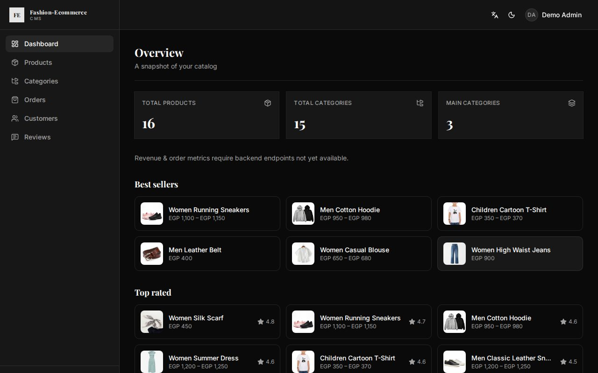
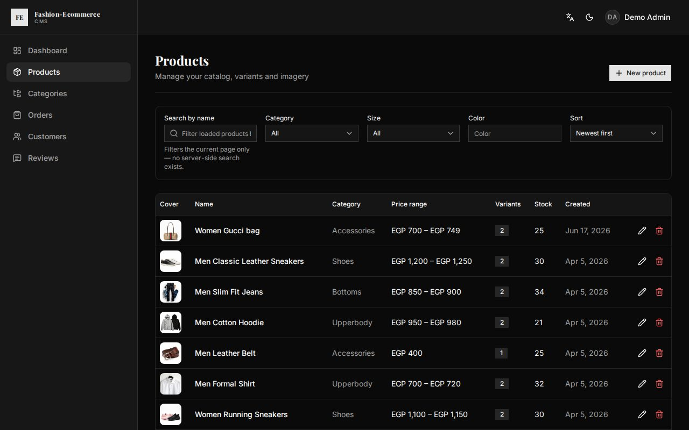
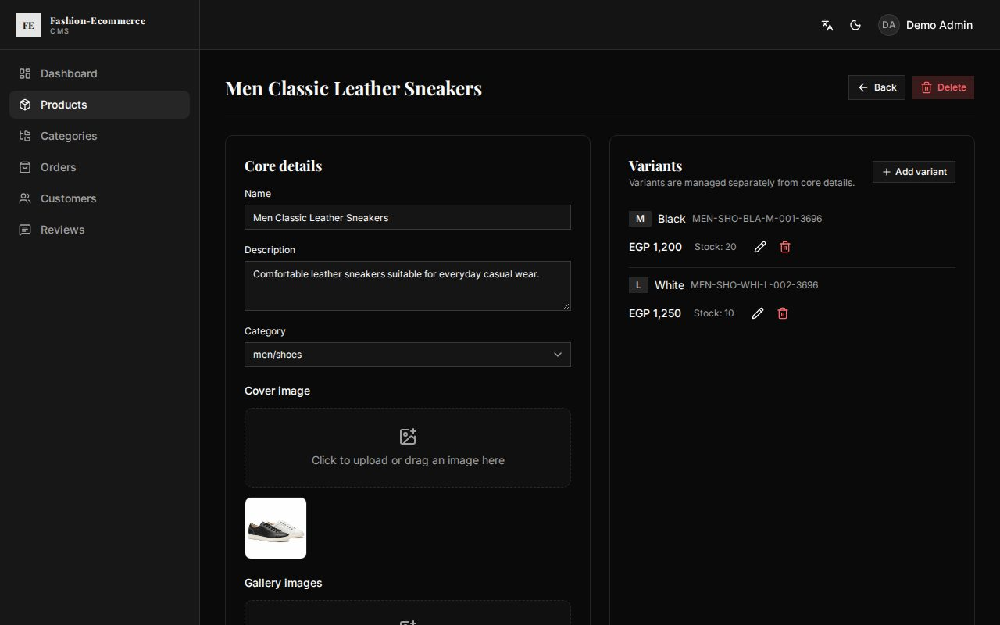
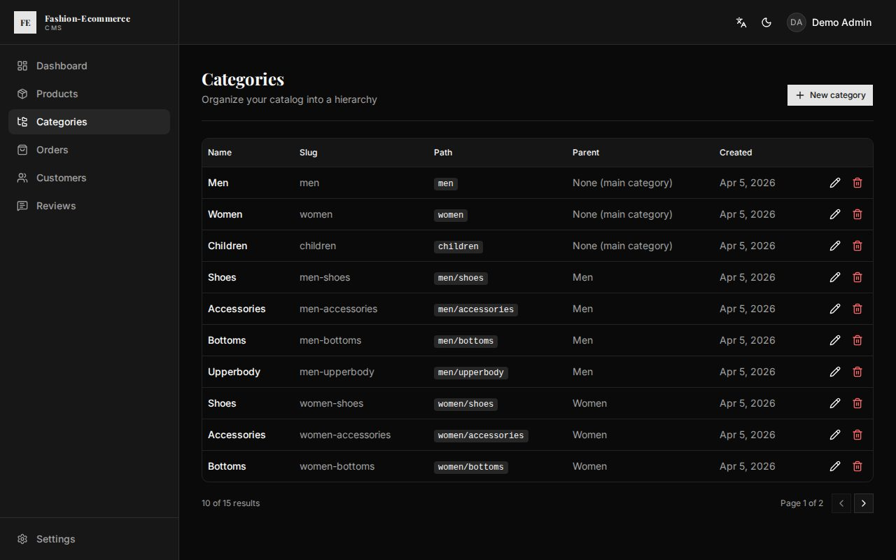
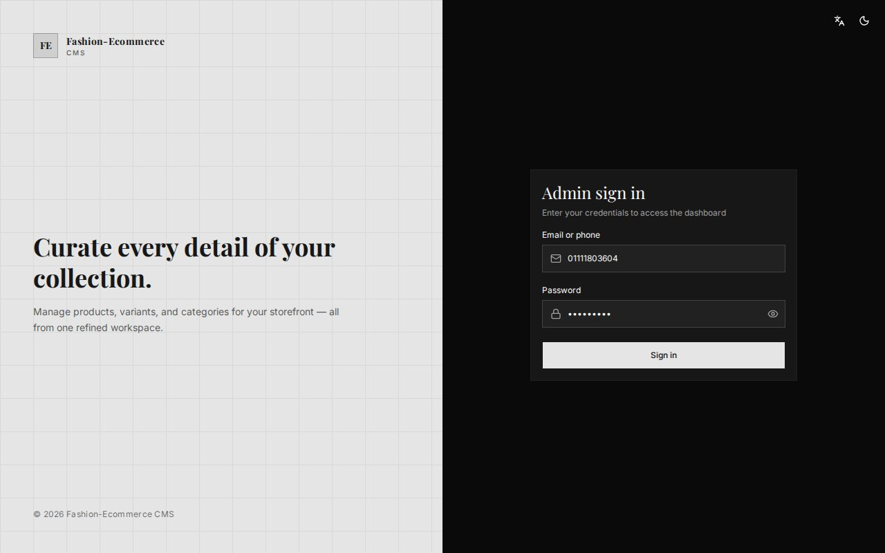
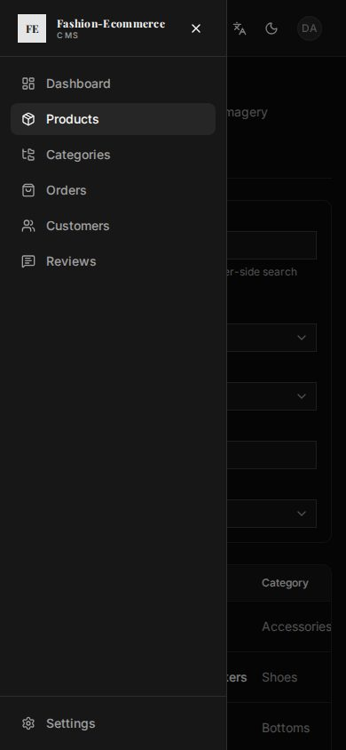

# Fashion E‑Commerce Dashboard

[](https://github.com/Shamsmedhat/fashion-ecommerce-dashboard/actions/workflows/ci.yml)

Admin CMS for managing products, variants, and categories of the fashion store.

**Live:** https://fashion-ecommerce-dashboard.vercel.app

The login form opens pre‑filled with a demo admin account, so you can sign in with one click.

## Screenshots

| Overview | Products |
|---|---|
|  |  |

| Product and its variants | Categories |
|---|---|
|  |  |

| Login (demo account pre-filled) | Navigation on a phone |
|---|---|
|  |  |

## Stack

React 19 · Vite · TypeScript · TanStack Router/Query · Zustand · React Hook Form + Zod · Tailwind v4 · shadcn/ui · i18n (EN/AR, RTL)

## What it does

- **Products** — list with filters, sorting and pagination; create, edit and delete; images
  upload straight from the browser to Cloudinary with a signature from the API.
- **Variants** — size, colour, price, stock and discount per variant.
- **Categories** — a two‑level tree; rename, move and delete (the API refuses to delete a
  category that still has products or subcategories).
- **Storefront sync** — after every edit the dashboard asks the storefront to refresh its
  cached pages, so changes show up immediately.
- **Sessions** — the token is checked against the API on load, and an expired session returns
  to the login page.
- English and Arabic, light and dark, and a drawer navigation on small screens.

## Local setup

```bash
yarn install
cp .env.example .env
yarn dev
```

App runs at http://localhost:5173. It needs the API: in the
[backend repo](https://github.com/Shamsmedhat/fashion-e-commerce-backend), `yarn dev:memory`
starts it on a seeded in‑memory database with the same demo admin account.

### Env vars

| Variable | Description |
|---|---|
| `VITE_API_URL` | Backend base URL (includes `/api/v1`) |
| `VITE_STOREFRONT_URL` | Storefront URL for ISR cache revalidation |

Both are required: the production build fails with a clear message if one is missing.

## Scripts

| Command | Description |
|---|---|
| `yarn dev` | Start dev server |
| `yarn build` | Type-check and build for production |
| `yarn preview` | Preview production build |
| `yarn test` | Run unit and component tests (Vitest) |
| `yarn test:e2e` | Run end‑to‑end tests (Playwright) |
| `yarn lint` | Lint the project |
| `yarn typecheck` | Type-check, including the project's own `.d.ts` files |

## Tests

`yarn test` runs the unit and component tests. `yarn test:e2e` drives the real dashboard in a
browser against the real API on a throwaway in‑memory database; it expects the backend repo
next to this one (or `BACKEND_DIR`), and `npx playwright install chromium` once beforehand.
CI runs both, plus lint and the build, on every push.

## Related repos

| Repo | Role |
|---|---|
| [fashion-e-commerce-backend](https://github.com/Shamsmedhat/fashion-e-commerce-backend) | Express + MongoDB API |
| [fashion-e-commerce-frontend](https://github.com/Shamsmedhat/fashion-e-commerce-frontend) | Next.js storefront |

Production API: `https://fashion-ecommerce-backend-teal.vercel.app/api/v1`

For full architecture details, see [`docs/ARCHITECTURE.md`](docs/ARCHITECTURE.md).
