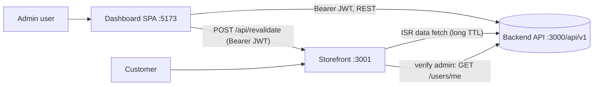
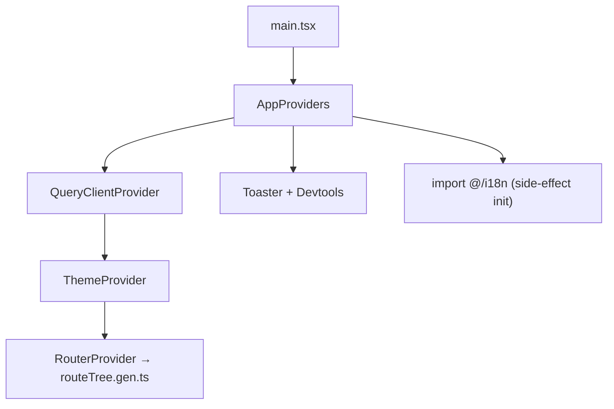
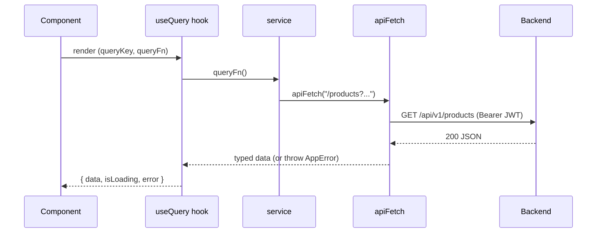
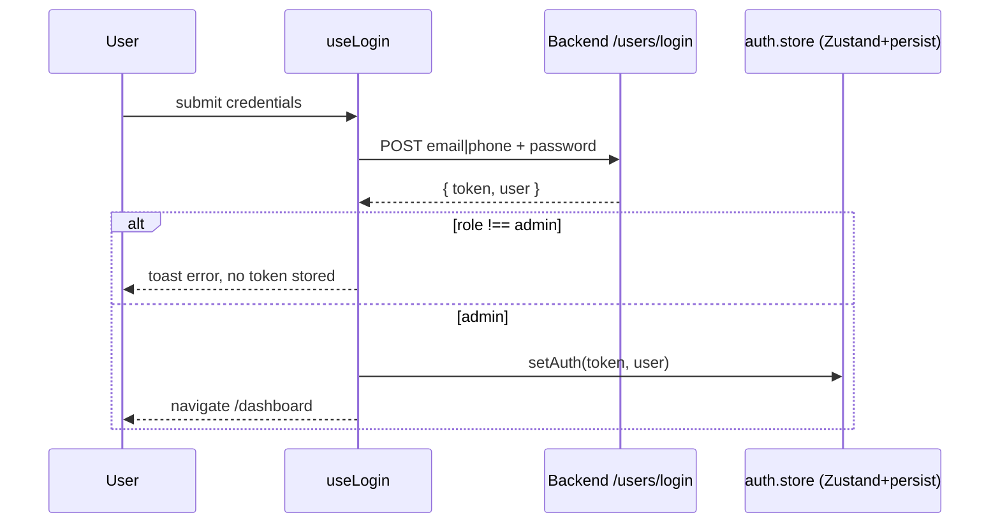
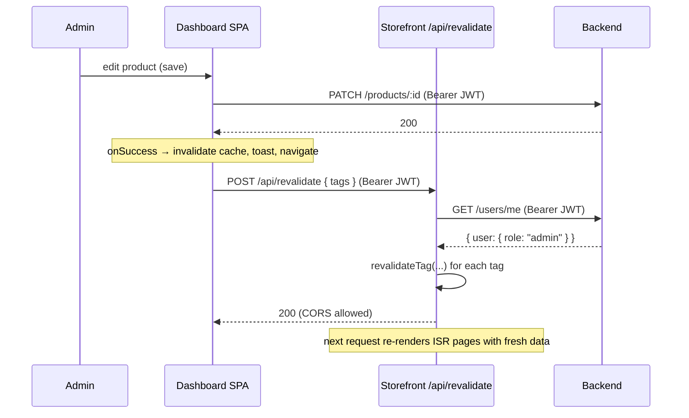

# Fashion E‑Commerce — Dashboard (Admin CMS) Architecture

This document explains how the **admin dashboard SPA** is built, every library it
uses and why, and how data flows end‑to‑end — including the cross‑repo **on‑demand
ISR cache revalidation** that connects the CMS to the storefront.

---

## 1. System context

The product is split across three independent repositories:

| Repo | Role | Stack | Port (local) |
|---|---|---|---|
| `fashion-ecommerce-dashboard` | **Admin CMS** — manage products, variants, categories | Vite + React 19 SPA | `5173` |
| `fashion-ecommerce-frontend` | **Storefront** — customer‑facing shop | Next.js 14 (App Router, ISR) | `3001` |
| `fashion-ecommerce-backend` | **API** — data + auth | Express + Mongoose, JWT | `3000` (`/api/v1`) |



The dashboard is a pure **client‑side SPA**: it talks directly to the backend with the
admin's JWT, and — after any content edit — pings the storefront so its long‑lived ISR
cache is invalidated immediately instead of waiting out the TTL. (See §12.)

---

## 2. Tech stack — every library and its role

### Runtime dependencies

| Library | Version | What it does here |
|---|---|---|
| `react` / `react-dom` | ^19.2 | UI runtime. React 19 + the React Compiler (see Babel plugin below). |
| `@tanstack/react-router` | ^1.168 | **File‑based routing**. Type‑safe routes, `beforeLoad` guards, intent‑based preloading, scroll restoration. |
| `@tanstack/react-query` | ^5.95 | **Server‑state**: caching, background refetch, query invalidation, mutations. The single source of truth for remote data. |
| `zustand` | ^5.0 | **Global client state** — only the auth slice (`token` + `user`), persisted to `localStorage`. |
| `react-hook-form` | ^7.72 | **Form state & validation** (uncontrolled inputs, minimal re‑renders). |
| `@hookform/resolvers` | ^5.4 | Bridges RHF to Zod (`zodResolver`). |
| `zod` | ^4.3 | **Schema validation**; TS types are derived from schemas via `z.infer`. |
| `i18next` | ^26 | i18n core (translation catalog, interpolation). |
| `react-i18next` | ^17 | React bindings — the `useTranslation()` / `t()` hook. |
| `i18next-browser-languagedetector` | ^8.2 | Detects language from `localStorage` → browser. |
| `radix-ui` | ^1.4 | Unstyled, accessible primitives (dialog, dropdown, select, tabs, switch…). The base shadcn/ui builds on. |
| `class-variance-authority` | ^0.7 | Type‑safe component **variant** definitions (e.g. button sizes/intents). |
| `clsx` | ^2.1 | Conditional `className` joining. |
| `tailwind-merge` | ^3.5 | Dedupes/merges conflicting Tailwind classes (`cn()` helper). |
| `lucide-react` | ^1.7 | Icon set. |
| `next-themes` | ^0.4 | Dark/light theme switching via the `class` attribute. |
| `sonner` | ^2.0 | Toast notifications (success/error feedback on mutations). |
| `@fontsource/inter`, `@fontsource/playfair-display` | ^5.2 | Self‑hosted fonts (UI sans + display serif). |

### Tooling / dev dependencies

| Library | Role |
|---|---|
| `vite` (8) + `@vitejs/plugin-react` | Dev server + production bundler. |
| `@tanstack/router-plugin` | Generates `src/routeTree.gen.ts` from the `routes/` folder. |
| `@rolldown/plugin-babel` + `babel-plugin-react-compiler` | Runs the **React Compiler** (auto‑memoization) during build. |
| `@tailwindcss/vite` + `tailwindcss` (v4) + `tw-animate-css` | Utility‑first styling; Tailwind v4 is configured via CSS, not a JS config. |
| `shadcn` | CLI that scaffolds `components/ui/*` (Radix + Tailwind). **Never hand‑edited.** |
| `typescript` (~5.9) + `typescript-eslint` | Strict typing + lint rules. |
| `eslint` (9) + `@tanstack/eslint-plugin-query` + `eslint-plugin-react-hooks` + `eslint-plugin-react-refresh` | Linting, including Query‑specific and hooks rules. |
| `vitest` (4) | Unit testing (see `src/**/*.test.ts`). |
| `@tanstack/react-query-devtools`, `@tanstack/react-router-devtools` | In‑app debugging panels. |

---

## 3. Folder structure

```
src/
├── main.tsx                # entry — mounts <AppProviders/>
├── providers/              # app-wide providers (Query, Router, Theme, Toaster)
├── config/                 # router, query config, query keys, env, constants
├── routes/                 # TanStack Router file-based routes (+ routeTree.gen.ts)
├── layouts/                # shell components (auth-layout, dashboard-layout)
├── features/               # domain modules (auth, products, categories, dashboard)
│   └── <feature>/
│       ├── components/     # feature UI
│       ├── hooks/          # React Query hooks (queries + mutations)
│       ├── schemas/        # Zod schemas
│       ├── services/       # API calls (via apiFetch)
│       └── types/          # feature types (.d.ts)
├── services/               # shared services (api.ts, revalidate.ts)
├── store/                  # Zustand stores (auth.store.ts)
├── components/
│   ├── ui/                 # shadcn primitives — generated, do not edit
│   ├── shared/             # generic, domain-free UI (DataTable, PageHeader…)
│   └── skeletons/          # loading skeletons
├── i18n/                   # i18next setup + locales (en.json, ar.json)
├── utils/                  # app-errors, catch-error, build-query-string, format
└── index.css               # Tailwind v4 entry + theme tokens
```

The cardinal rule (from `.cursor/rules/`): a feature flows **service → hook → component**.
Components never call `fetch` directly; hooks never build URLs; services never touch React.

---

## 4. Bootstrap flow

```
index.html  →  src/main.tsx  →  <AppProviders/>
```

1. **`main.tsx`** creates the React root in `<StrictMode>` and renders `<AppProviders/>`.
2. **`providers/app-providers.tsx`** wires the global context, in this order:
   - `QueryClientProvider` — one `QueryClient` with defaults: `staleTime: 5min`, `retry: 1`, `refetchOnWindowFocus: false`.
   - `ThemeProvider` (next-themes) — `attribute="class"`, `defaultTheme="dark"`.
   - `RouterProvider` — drives all rendering from the route tree.
   - `Toaster` (sonner) + `ReactQueryDevtools`.
   - `import "@/i18n"` runs the i18next side‑effect init before the tree renders.



---

## 5. Routing & guards (TanStack Router)

Routes are **file‑based**: every file under `src/routes/` maps to a URL, and the
`@tanstack/router-plugin` regenerates `src/routeTree.gen.ts` automatically.

```
routes/
├── __root.tsx                     # root: just <Outlet/>
├── index.tsx                      # "/" → redirect (admin→/dashboard, else→/auth/login)
├── auth/login.tsx                 # /auth/login
└── dashboard/
    ├── route.tsx                  # /dashboard layout + AUTH GUARD
    ├── index.tsx                  # /dashboard (home)
    ├── products/{index,new,$id}   # list / create / detail+edit
    ├── categories/{index,new,$id}
    ├── customers · orders · reviews · settings
```

**Route guards** use `beforeLoad`, which reads the Zustand store *imperatively*
(`useAuthStore.getState()`), so the check runs outside React render:

```12:14:src/routes/dashboard/route.tsx
    const { token, user } = useAuthStore.getState();
    if (!token || user?.role !== "admin") {
      throw redirect({ to: "/auth/login" });
```

- `/` redirects based on auth state.
- `/dashboard/*` is admin‑gated; non‑admins are bounced to login.
- `defaultPreload: "intent"` preloads a route's code/data on link hover/focus.

Page components use `createFileRoute(...)` and are the **only** place default exports
are allowed (per the project rules); everything else uses named exports.

---

## 6. Data layer

### 6.1 `apiFetch` — the single HTTP client (`src/services/api.ts`)

A thin typed wrapper over `fetch` that:

- Prefixes relative paths with `env.API_URL` (full paths pass through untouched).
- Sends `Authorization: Bearer <token>` by reading the token from the Zustand store.
- JSON‑encodes bodies, **except `FormData`** (left as‑is so the browser sets the
  multipart boundary — used for product image uploads).
- On non‑2xx, throws a typed **`AppError`** (`statusCode` + `type`).
- Returns `undefined` for `204 No Content` (deletes).

### 6.2 React Query — server state

Every remote read is a `useQuery`; every write is a `useMutation`. Cache identity is
governed by **centralized query keys** (`config/query-keys.ts`) and **named stale
times** (`config/query.config.ts`):

```1:7:src/config/query.config.ts
export const STALE_TIMES = {
  REAL_TIME: 0,
  SHORT: 1000 * 30,
  STANDARD: 1000 * 60 * 5,
  LONG: 1000 * 60 * 30,
  PERMANENT: Infinity,
} as const;
```

A read hook (`features/products/hooks/use-products.ts`):

```13:19:src/features/products/hooks/use-products.ts
export function useProducts(filters?: ProductFilters) {
  return useQuery({
    queryKey: queryKeys.products.list(filters),
    queryFn: () => getProductsService(filters as Record<string, string | number | undefined>),
    staleTime: STALE_TIMES.STANDARD,
  });
}
```

### 6.3 Request flow (read)



`buildQueryString` (`utils/build-query-string.ts`) serializes filter objects into query
strings, skipping empty values, so list endpoints stay clean.

---

## 7. Authentication flow

State lives in a tiny **persisted Zustand store** (`store/auth.store.ts`, key
`auth-storage` in `localStorage`):

```typescript
{ token: string | null, user: AdminUser | null, setAuth, clearAuth }
```

**Login** (`features/auth/hooks/use-login.ts`):

1. `loginService` posts to `/users/login`. The identifier is auto‑detected as **phone**
   (starts with `01`) or **email**.
2. On success an **admin gate** runs — a non‑admin role is rejected with a toast and the
   token is never stored.
3. Admins: `setAuth(token, user)` → navigate to `/dashboard`.
4. `429` (rate limited by the backend) gets a dedicated message.

**Logout** (`use-logout.ts`): best‑effort server cookie clear, then `clearAuth()`,
`queryClient.clear()` (drop all cached data), and redirect to login.



Because the token is in the store, `apiFetch` automatically attaches it to every call,
and route guards read it synchronously via `getState()`.

---

## 8. Forms (React Hook Form + Zod)

- Schemas are **factory functions** that take `t` so validation messages are localized:

```5:10:src/features/auth/schemas/auth.schema.ts
export function buildLoginSchema(t: Translate) {
  return z.object({
    identifier: z.string().min(1, t("validation-identifier-required")),
    password: z.string().min(1, t("validation-password-required")),
  });
}
```

- Types are derived from the schema: `type LoginFields = z.infer<ReturnType<typeof buildLoginSchema>>`.
- Components wire RHF with `zodResolver(schema)` and the shadcn `Form` primitives.
- Submission calls a mutation hook (`login`, `createProduct`, …) — the component never
  knows about HTTP.

---

## 9. Anatomy of a feature (products)

```
features/products/
├── services/product.service.ts     # getProducts, createProduct (FormData), updateVariant…
├── hooks/use-products.ts           # useQuery reads
├── hooks/use-product-mutations.ts  # create / update / delete (useMutation)
├── hooks/use-variant-mutations.ts  # variant create / update / delete
├── schemas/product.schema.ts       # Zod
├── types/product.d.ts
├── components/                     # ProductsTable, ProductCreateForm, VariantManager…
└── utils/product-stats.ts
```

A **mutation hook** ties it together — call the service, then invalidate caches, toast,
navigate, and (new) revalidate the storefront:

```26:34:src/features/products/hooks/use-product-mutations.ts
  const { isPending, mutate } = useMutation({
    mutationFn: (formData: FormData) => createProductService(formData),
    onSuccess: () => {
      queryClient.invalidateQueries({ queryKey: queryKeys.products.all });
      revalidateStorefront(["products", "best-selling"]);
      toast.success(t("product-created"));
      navigate({ to: "/dashboard/products" });
    },
    onError: (error) => toast.error(getErrorMessage(error)),
  });
```

Products and categories follow the identical pattern (variants reuse a shared
`useInvalidateProduct` helper).

---

## 10. Internationalization & RTL

`src/i18n/index.ts` initializes i18next with `en` + `ar` catalogs and a language
detector (`localStorage` key `app-language` → browser). It also keeps the document in
sync:

```17:21:src/i18n/index.ts
export function applyDirection(lng: string): void {
  const dir = lng === "ar" ? "rtl" : "ltr";
  document.documentElement.lang = lng;
  document.documentElement.dir = dir;
}
```

`utils/format.ts` uses `Intl` for locale‑aware numbers, **EGP** currency, dates, and
the Arabic numbering system (`arab` vs `latn`). Components translate via `useTranslation()`.

---

## 11. Theming, styling & UI

- **Tailwind CSS v4** is configured in `index.css` (CSS‑first, no JS config); theme
  tokens map to `bg-background`, `text-foreground`, etc.
- **next-themes** toggles a `class` on `<html>` (default dark); `ThemeToggle` flips it.
- **shadcn/ui** components in `components/ui/*` are generated from Radix primitives and
  **must not be hand‑edited**. Variants come from `class-variance-authority`; classes are
  merged with `cn()` (`clsx` + `tailwind-merge`).
- `components/shared/*` holds domain‑free building blocks (`DataTable`, `PageHeader`,
  `Pagination`, `StatusBadge`, `EmptyState`, `ErrorState`, skeleton loaders…).

---

## 12. Cross‑repo flow: on‑demand ISR cache revalidation

The storefront caches API data with long ISR TTLs keyed by **tags**
(`products`, `product-{id}`, `best-selling`, `categories`, `main-categories`, …).
Without a signal, a CMS edit wouldn't appear on the storefront until the TTL expired.
This dashboard now pings the storefront after every content mutation.

### Dashboard side — `src/services/revalidate.ts`

A **fire‑and‑forget** helper (never blocks the UI, never throws, logs failures only). It
uses a **dedicated `fetch`** — *not* `apiFetch`, because `apiFetch` would prefix the
backend `API_URL`; here we target the storefront's `STOREFRONT_URL`:

```7:27:src/services/revalidate.ts
export function revalidateStorefront(tags: string[]): void {
  if (!env.STOREFRONT_URL || tags.length === 0) return;

  // Dedicated fetch — must NOT use apiFetch (it prefixes the backend API_URL).
  const token = useAuthStore.getState().token;

  void fetch(`${env.STOREFRONT_URL}/api/revalidate`, {
    method: "POST",
    headers: {
      "Content-Type": "application/json",
      ...(token ? { Authorization: `Bearer ${token}` } : {}),
    },
    body: JSON.stringify({ tags }),
  })
    .then((res) => {
      if (!res.ok) {
        console.error(`Storefront revalidation failed: ${res.status} ${res.statusText}`);
      }
    })
    .catch((error) => {
      console.error("Storefront revalidation request failed", error);
    });
}
```

It is called from each mutation's `onSuccess`. **Tag mapping:**

| CMS action | tags sent |
|---|---|
| Product create | `["products", "best-selling"]` |
| Product update `{id}` | `["products", "product-{id}", "best-selling"]` |
| Product delete `{id}` | `["products", "product-{id}", "best-selling"]` |
| Variant create/update/delete on `{productId}` | `["products", "product-{productId}"]` |
| Category create/update/delete | `["categories", "main-categories"]` |

### Storefront side — `src/app/api/revalidate/route.ts`

No static shared secret. Authorization is the **admin's JWT**, verified against the
backend, plus CORS for the browser hop:

1. Read `Authorization: Bearer <token>` → call `GET ${API_URL}/users/me`.
   - non‑200 → **401**; `data.user.role !== "admin"` → **403**.
2. Accept `{ tag }` or `{ tags[] }`; validate each against the allowlist or the
   `product-{id}` pattern (**400** on malformed body), then `revalidateTag` each.
3. CORS: `OPTIONS` handler + headers (`Allow-Origin: CMS_ORIGIN`, methods `POST, OPTIONS`,
   headers `Authorization, Content-Type`) on every response.

### Backend side — `GET /api/v1/users/me`

`authController.protect` → `userController.getMe` returns the authenticated `req.user`
(including `role`). The JWT payload only carries `{ id }`, so the storefront needs this
endpoint to learn the caller's role.

### End‑to‑end sequence



---

## 13. Error handling

- `utils/app-errors.ts` — `AppError` carries `statusCode` and `type`
  (`authentication | authorization | general`); `apiFetch` maps HTTP status → type.
- `utils/catch-error.ts` — `getErrorMessage(unknown)` normalizes anything into a string
  for toasts; `catchError` wraps unknowns into `AppError`.
- Mutations surface failures via `onError → toast.error(getErrorMessage(error))`.
- Storefront revalidation is intentionally **silent on failure** (logged, never toasted)
  so a stale cache never breaks the admin's save.

---

## 14. Configuration & environment

`src/config/env.ts` centralizes Vite env vars (all client vars are `VITE_`‑prefixed):

| Var | Example | Used by |
|---|---|---|
| `VITE_API_URL` | `http://localhost:3000/api/v1` | `apiFetch` base URL |
| `VITE_STOREFRONT_URL` | `http://localhost:3001` | `revalidateStorefront` target |

Other config: `config/constants.ts` (`DEFAULT_PAGE/LIMIT/SORT`, image‑upload guards,
variant sizes), `config/router.ts`, `config/query.config.ts`, `config/query-keys.ts`.

Storefront env (for the revalidate route): `API_URL`, `CMS_ORIGIN`
(= `http://localhost:5173`), `NEXTAUTH_SECRET`. `REVALIDATE_SECRET` is no longer used.

---

## 15. Scripts, tooling & tests

| Command | Action |
|---|---|
| `yarn dev` | Vite dev server (`:5173`). |
| `yarn build` | `tsc -b` typecheck + `vite build` (runs the React Compiler via Babel). |
| `yarn lint` | ESLint (TS, React hooks, Query rules). |
| `yarn test` / `yarn test:watch` | Vitest. |
| `yarn preview` | Serve the production build locally. |

Tests live next to their subjects (`src/services/api.test.ts`,
`src/utils/build-query-string.test.ts`). The React Compiler auto‑memoizes components at
build time, so manual `useMemo`/`useCallback` are rarely needed.

---

## 16. Conventions (enforced by `.cursor/rules/`)

- **Flow:** `service → hook → component`. Components don't fetch; services don't use React.
- **Types:** strict, no `any`; derive types from Zod with `z.infer`; explicit return types.
- **Exports:** named everywhere; default export only for route page components.
- **Naming:** routes kebab‑case, components PascalCase, hooks `useX`, schemas `xSchema`,
  stores `x.store.ts`, types `x.d.ts`, feature folders plural.
- **Cache keys** always come from `config/query-keys.ts` (never inline arrays).
- **No** `console.log`, dead code, unused imports, or array‑index React keys.
- **Never** hand‑edit `components/ui/*` (shadcn‑generated).
```
